# Aria's Atelier — Haute Horlogerie

> A cinematic, editorial concept boutique for the world's finest timepieces —
> Rolex, Omega, Audemars Piguet, Cartier, Patek Philippe and Jaeger‑LeCoultre —
> each piece hand‑selected, authenticated and presented with reverence.

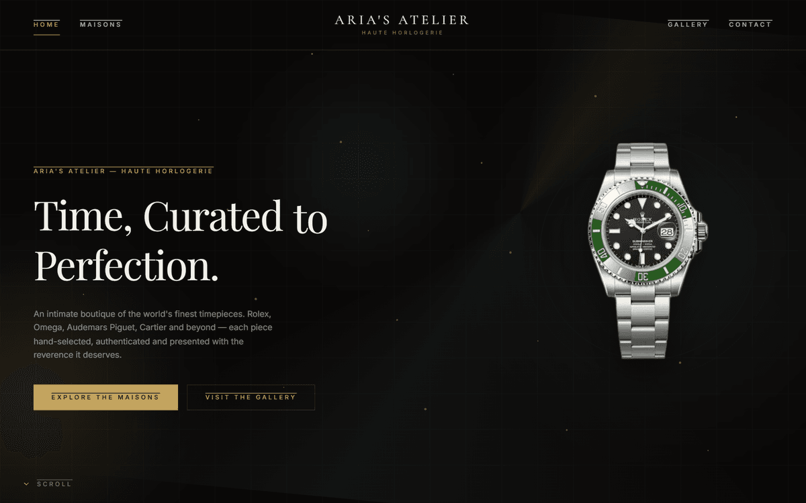

A campus / portfolio project exploring how a luxury *haute horlogerie* house would
present itself online: dark, gold‑accented, unhurried, and heavy on motion. This
document walks through the whole thing — from the first Figma frames to the final
deployed site — and explains the decisions behind each part.

**Live site:** deployed on Vercel · **Stack:** Next.js 16 · React 19 · TypeScript · Tailwind CSS v4 · Motion (Framer Motion)

---

## 1 · The concept

Aria's Atelier is a fictional private salon based in Banjarbaru that curates six
legendary maisons. The brief I set myself:

- **Editorial, not e‑commerce‑y.** It should feel like a magazine spread, not a
  product grid.
- **The watch is the hero.** Every screen is built around a single, beautifully
  lit timepiece.
- **Dark and gold.** Deep near‑black (`#0a0908`, never pure black) with a warm
  gold accent and a cream section for contrast.
- **Motion everywhere, but restrained.** Slow reveals, floating watches, a
  scroll‑following hero, 3D showcases — all on a calm Expo.out easing curve.

---

## 2 · Designing it in Figma

Everything started in Figma. I designed the full system first — desktop **and**
mobile frames for Home, Maisons, Collection, a watch Detail page, Gallery and
Contact — and locked the type and colour language before writing any code.

| Home | Maisons |
|---|---|
| 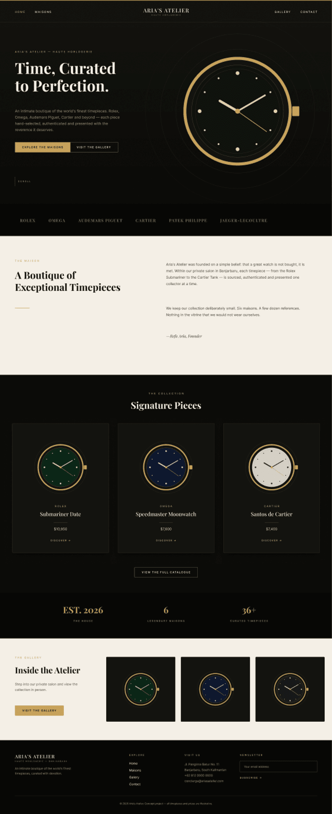 | 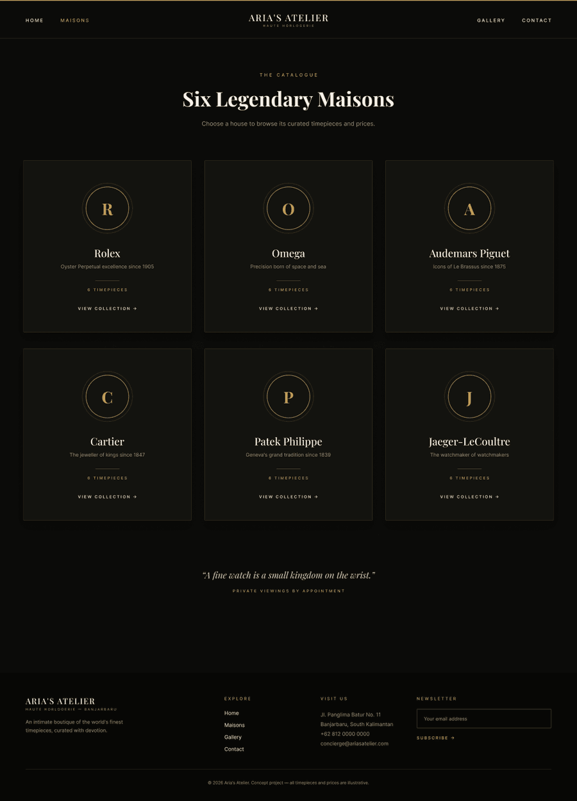 |

| Watch detail | Gallery |
|---|---|
| 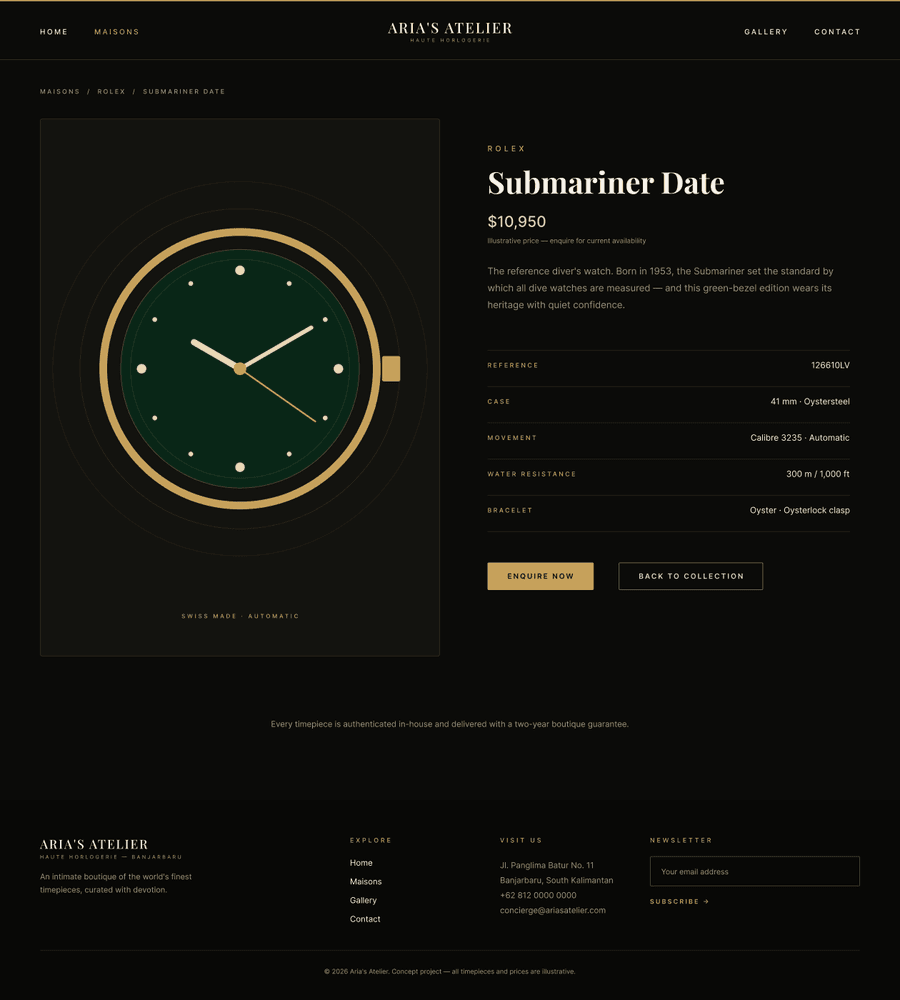 | 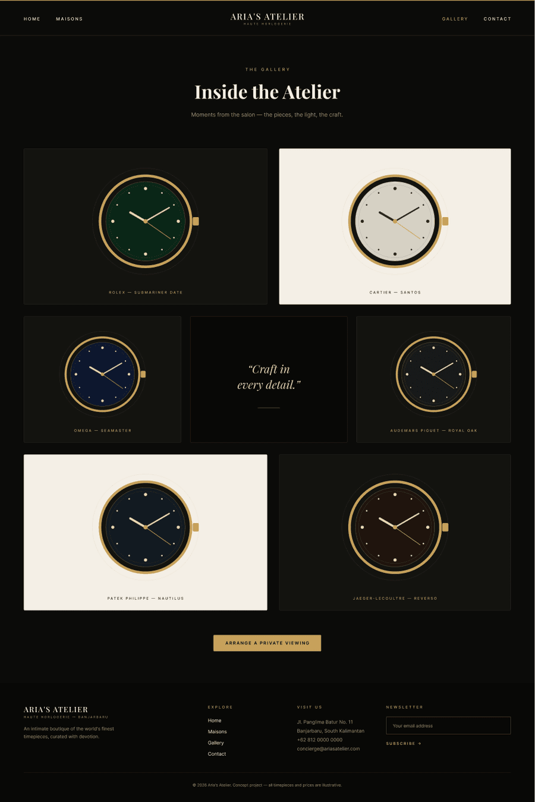 |

**The design language that came out of this:**

- **Typography** — *Playfair Display* for the big serif headlines, *Cormorant
  Garamond* for the wordmark and italic pull‑quotes, and *Inter* for the
  letter‑spaced overlines and body text.
- **Colour** — ink `#0a0908`, warm gold `#c2a35f`, cream `#f2ede2`.
- **Layout** — generous whitespace, a `1400px` max width, and the recurring motif
  of one watch centred in a pool of light.

---

## 3 · From design tokens to code

I translated the Figma system into CSS variables and a Tailwind v4 theme so the
whole site draws from one source of truth:

```css
:root {
  --ink: #0a0908;      /* deep near-black */
  --ink-2: #100e0b;    /* warm charcoal (cards) */
  --cream: #f2ede2;    /* light section */
  --gold: #c2a35f;     /* primary gold */
  --gold-soft: #d7bd85;
}

@theme inline {
  --color-ink: var(--ink);
  --color-gold: var(--gold);
  --font-serif: var(--font-playfair);
  --font-display: var(--font-cormorant);
  --font-sans: var(--font-inter);
}
```

The app is built on the **Next.js 16 App Router** with a route per surface
(`/`, `/maisons`, `/maisons/[brand]`, `/watch/[id]`, `/gallery`, `/contact`) and
36 timepieces statically generated at build time.

---

## 4 · Modelling the collection

Each timepiece is a data record — real reference numbers, approximate retail
prices and full specs — and a small rules engine derives how it should *look*
(dial finish, bezel type, hands, complications, case metal) from its own data:

```ts
export type Watch = {
  id: string;
  brandId: BrandId;
  name: string;
  reference: string;
  price: number;
  tagline: string;
  blurb: string;
  specs: { case: string; movement: string; water: string; bracelet: string };
  dialStyle: DialStyle;
};

// e.g. the metal is read straight from the case description
if (/yellow gold/i.test(watch.specs.case)) metal = "yellow-gold";
else if (/white gold/i.test(watch.specs.case)) metal = "white-gold";
else metal = "steel";
```

Early on, every watch was drawn as a **parametric SVG** — a component that renders
the case, bezel, applied indices, dauphine/Mercedes hands, date windows,
chronograph sub‑dials and a moon‑phase, all from that derived config. Later I
swapped in **real product photography**, keeping the SVG render as a graceful
fallback if an image is ever missing.

---

## 5 · Real photos, cleanly cut out

The product shots came on white studio backgrounds, which look wrong on a dark
theme. I automated the cut‑outs with an image pipeline (Node + `sharp`): an
ML matte for most pieces, and a high‑contrast edge‑flood for the dark‑strap
watches (where it protects the strap instead of eating it), then **trim +
normalise every image to a uniform square canvas** so they all display at a
consistent size.

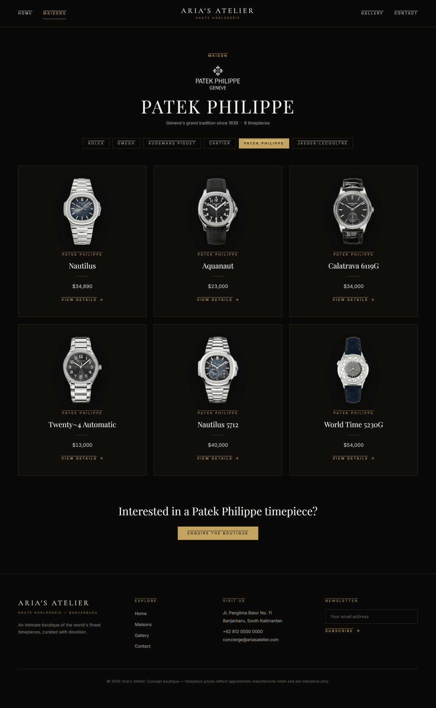

The result: steel reads as steel, gold as gold, and every dial keeps its true
colour.

---

## 6 · Motion & interaction

This is where most of the time went.

- **Scroll‑following hero** — the watch shrinks and hands off to a small,
  clickable watch pinned in the corner that follows you to the bottom.
- **Per‑watch detail pages**, themed from the dial colour, with a parallax brand
  watermark, an animated "highlight stage" for the full watch, and an **"In
  Motion" 3D showcase** that swivels the watch on a perspective axis.

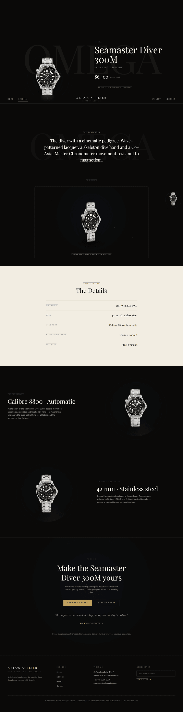

- **A full‑screen slide‑in menu** — a numbered "Navigate" panel with the six
  maisons and a "Featured Timepieces" grid, staggering in on an Expo.out curve.

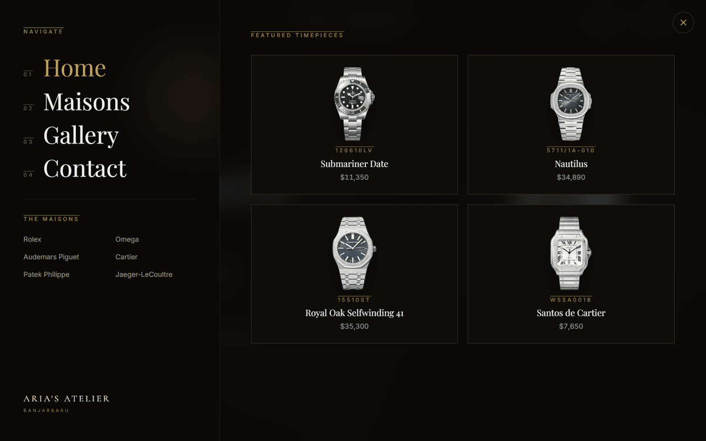

- **Hover‑to‑reveal maison cards** — each house's monogram dissolves into its
  signature watch.

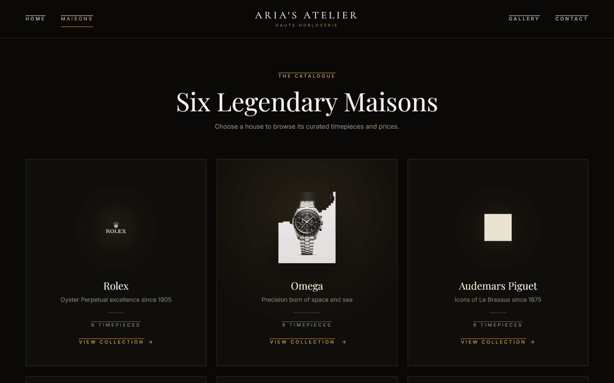

- **The Gallery** — a mixed dark/cream masonry of the collection.

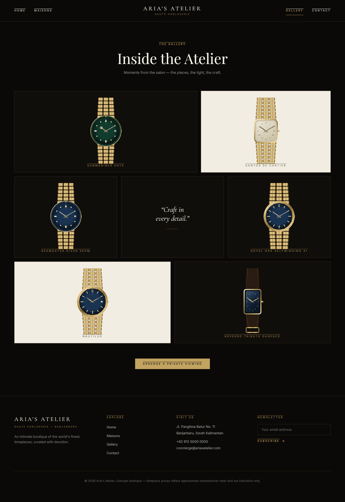

All animations share one easing token (`cubic-bezier(0.16, 1, 0.3, 1)`, i.e.
Expo.out), press‑scale feedback on interactive elements, and respect
`prefers-reduced-motion`.

---

## 7 · Responsive & a real mobile bug

The whole site was built to reflow to a single column on phones, with the menu
and detail pages tuned for small screens.

| Mobile detail | Mobile menu |
|---|---|
| 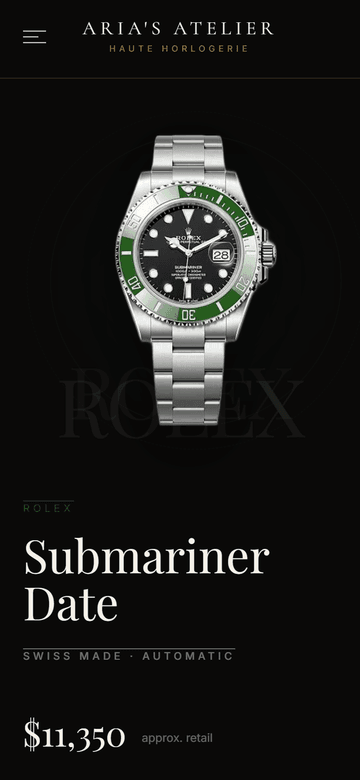 | 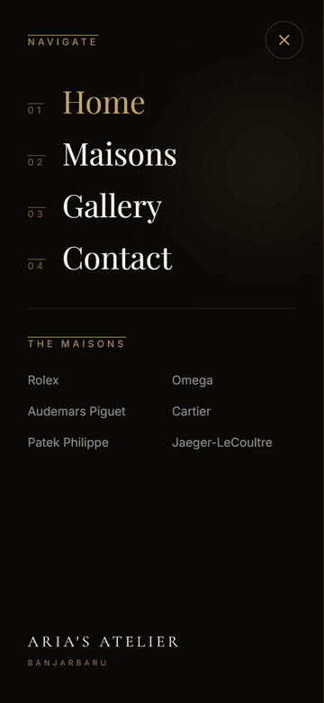 |

One issue I had to solve properly: on mobile the scroll‑reveal animations were
flaky — `IntersectionObserver` misses triggers when the address bar resizes the
viewport, so content could get stuck invisible. The fix was a small hook that
reveals content shortly after mount on touch screens (no scroll required) while
keeping scroll‑reveals on desktop, with a safety timeout so nothing can ever stay
hidden:

```tsx
export function useRevealVisible(ref, amount = 0.15) {
  const inView = useInView(ref, { once: true, amount, margin: "0px 0px -8% 0px" });
  const [forced, setForced] = useState(false);
  useEffect(() => {
    const small = matchMedia("(max-width: 767px)").matches;
    const reduce = matchMedia("(prefers-reduced-motion: reduce)").matches;
    const t = setTimeout(() => setForced(true), small || reduce ? 120 : 2600);
    return () => clearTimeout(t);
  }, []);
  return inView || forced;
}
```

---

## 8 · Tech stack

| Area | Choice |
|---|---|
| Framework | Next.js 16 (App Router, static generation) |
| Language | TypeScript |
| Styling | Tailwind CSS v4 (CSS‑first `@theme`) |
| Animation | Motion (Framer Motion) |
| Fonts | Playfair Display · Cormorant Garamond · Inter (`next/font`) |
| Image pipeline | `sharp` + ML background removal |
| Hosting | Vercel (auto‑deploy on push to `main`) |

---

## 9 · Running it locally

```bash
npm install
npm run dev          # http://localhost:3000
# production build
npm run build && npm run start
```

---

## Notes & credits

Concept, art direction, Figma design and curation are my own work for this
project. Implementation was done with the help of an AI pair‑programmer
(**Claude Code**) for the code and image tooling.

This is a **non‑commercial student project for educational purposes.** All watch
images, brand names and logos are the property of their respective owners and are
used here for demonstration only — Aria's Atelier is fictitious and is not
affiliated with or endorsed by any brand.
